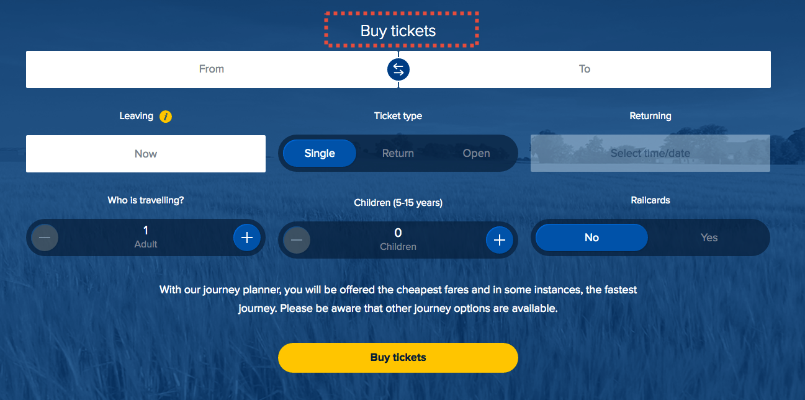
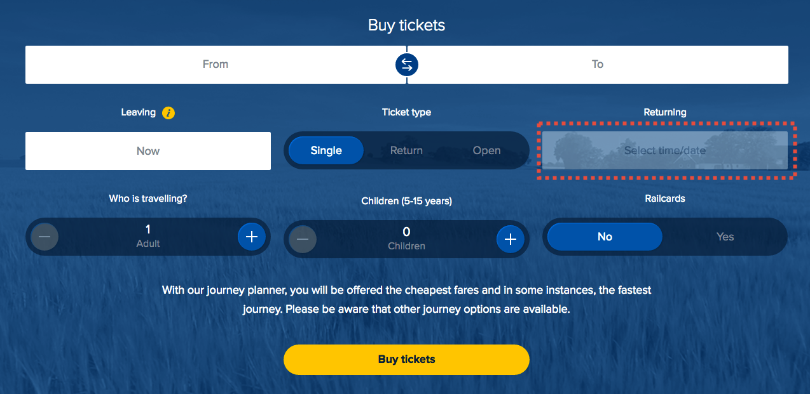

These exercises are part of the [Serenity Dojo](http://www.serenity-dojo.com/) training program, and are designed to help developers and testers learn how to work with Serenity Screenplay on real-world applications.

## The problem domain

In this series of exercises, we will be building up a test suite for a real-world web site: [SouthWestTrains](https://www.southwesttrains.co.uk/). Each tutorial will focus on implementing a particular test scenario. 

## Problem definition

The aim of these scenarios is to check the default values proposed on the 'Buy Tickets' screen.

### Step 1 - Checking text elements

Write a test that checks that 'Buy tickets' appears in the heading above the form.

Add a new `Target` to the `TypeTicketForm` class, e.g.

    public static final Target HEADING = Target.the("Buy Tickets Heading").locatedBy(".planner__title");

Now check that the text element contains the text "Buy tickets", e.g.

        tracy.should(
                seeThat(the(TicketTypeForm.HEADING), containsText("Buy tickets"))
        );
        
### Step 2 - Checking visibility
        
Add an assertion to the `sensible_default_trip_options_are_proposed` test to check that this element is visible, e.g.

        tracy.should(
                seeThat(the(TicketTypeForm.HEADING), isCurrentlyVisible())
        );

### Step 3 - checking attributes

Check that the placeholder for the 'From' field is equal to 'From'. You can do this by checking the `placeholder` attribute with the `TheTarget.attributeNamed()` method, e.g.

        tracy.should(
                seeThat(
                        TheTarget.attributeNamed("placeholder").forTarget(TicketTypeForm.FROM),
                        equalTo("From")
                )
        );

### Step 4 - checking CSS values

Check that the font of the heading is Sans Serif. You can do this by checking the `font` css attribute with the `TheTarget.attributeNamed()` method, e.g.

        tracy.should(
                seeThat(
                        TheTarget.cssValueNamed("font").forTarget(TicketTypeForm.HEADING),
                        containsString("sans-serif")
                )
        );

### Step 5 - checking selected values

In the `request_assisted_travel()` test, add a check to make sure that 'Dr' is selected in the title list using the `selectedValueOf` method, e.g.
 
         tracy.should(
                 seeThat(selectedValueOf(AssistedTravelPage.TITLE), is("Dr"))
         );

### Step 6 - checking select options

In the `request_assisted_travel()` test, check the available options in the Title dropdown using the `selectOptionsOf` method, e.g.

         tracy.should(
                seeThat(selectOptionsOf(AssistedTravelPage.TITLE), hasItems("Mr","Miss","Mrs","Dr","Other"))
         );
         
Now use the `containsSelectOption` matcher to check that the list contains 'Other', e.g.

         tracy.should(
                seeThat(the(AssistedTravelPage.TITLE), containsSelectOption("Other"))
         );

### Step 7 - Checking for disabled fields.

The Return date/time field (see below) is disabled unless the 'Return' button is clicked. Write a test to ensure that the return date is initially disabled, and is enabled when the user chooses the Return option.

First, add a Target for the return date field to the `TicketTypeForm` class, e.g.

    public static final Target RETURN_TIME = Target.the("Inbound time").located(By.name("InboundTime"));

Next, create a new test called `return_date_should_be_only_enabled_for_return_trips()` and check that, when the Buy Ticket page is opened, the return type is disabled, e.g.

        tracy.has(ChosenTo.bookATicket());

        tracy.should(
                seeThat(the(TicketTypeForm.RETURN_TIME), not(isEnabled()))
        );

Now get Tracy to click on the `Return` button and check that the return date is enabled. On this page, the `Return` radio button is actually hidden, so you need to click on the return label instead. Add a target that identifies this label, e.g.

    public static final Target RETURN_LABEL = Target.the("Return trip").locatedBy("//label[text()='Return']");

Add an interaction to get Tracy to click on this label, and then check that the return time is now enabled, e.g.

        tracy.attemptsTo(
                Click.on(TicketTypeForm.RETURN_LABEL)
        );

        tracy.should(
                seeThat(the(TicketTypeForm.RETURN_TIME), isEnabled())
        );

